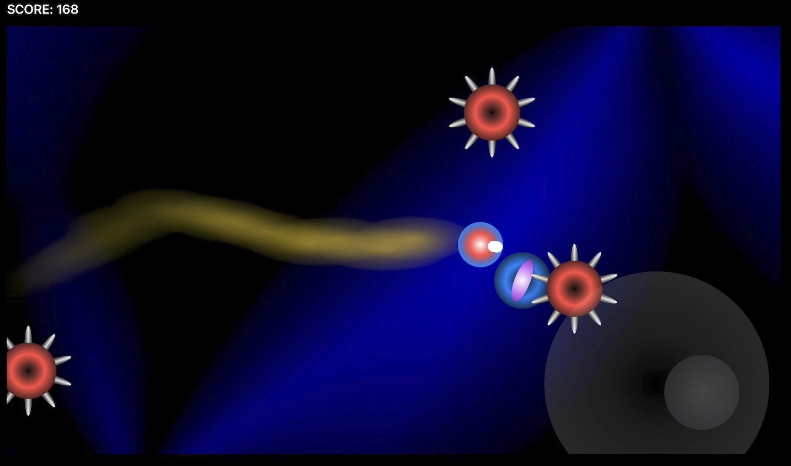

# SwiftUI Game
A little arcade game that uses SwiftUI as a game engine.
 

    
    
    
    
   

   

    

 

Just copy the code into the Blank playgroundbook in Swift Playgrounds app on iPad or Mac and run it!
Do not forget to turn off Enable Results in the settings of the playgroundBook, otherwise the game will not run.
